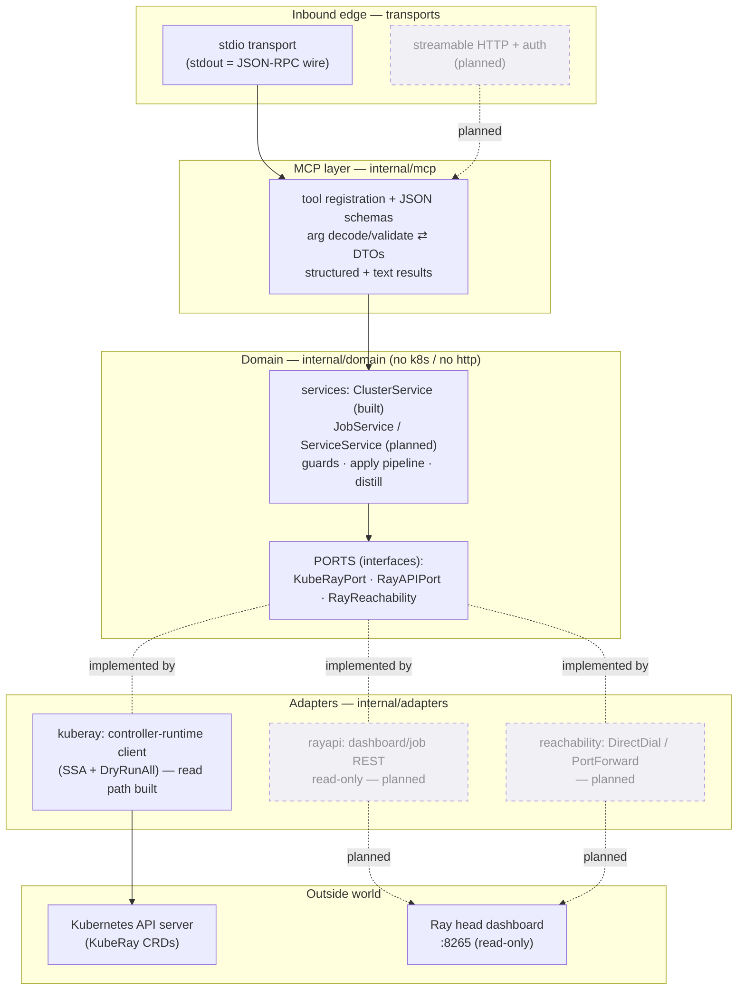
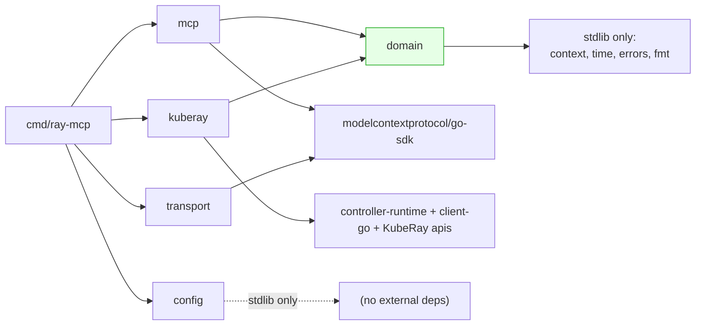
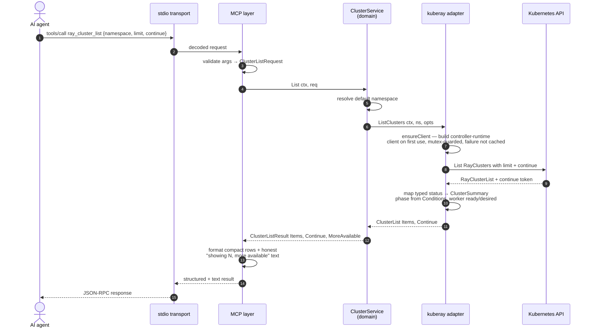
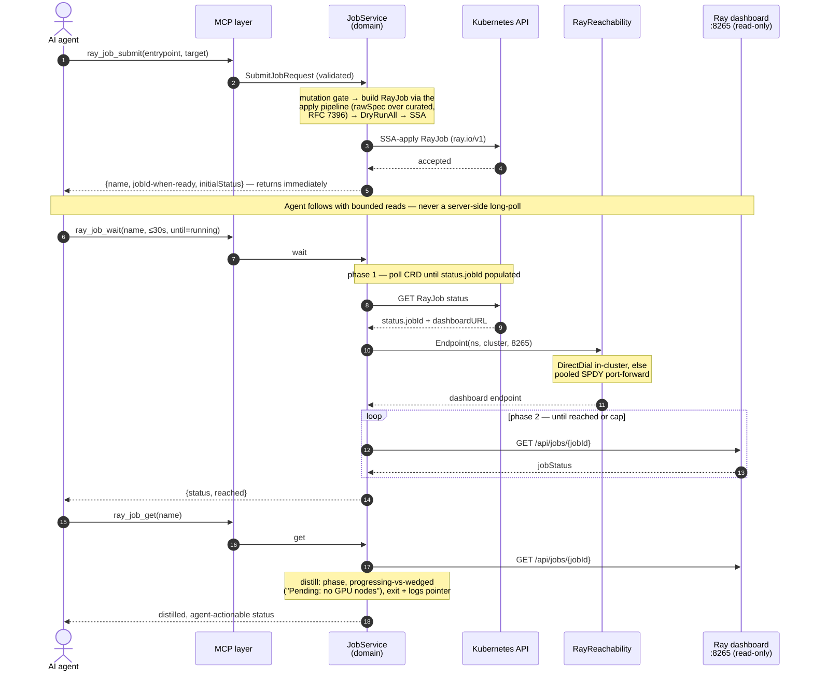
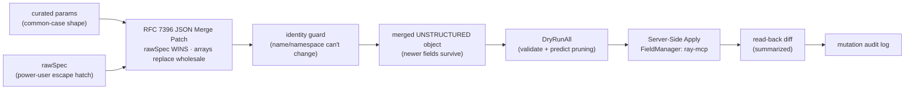
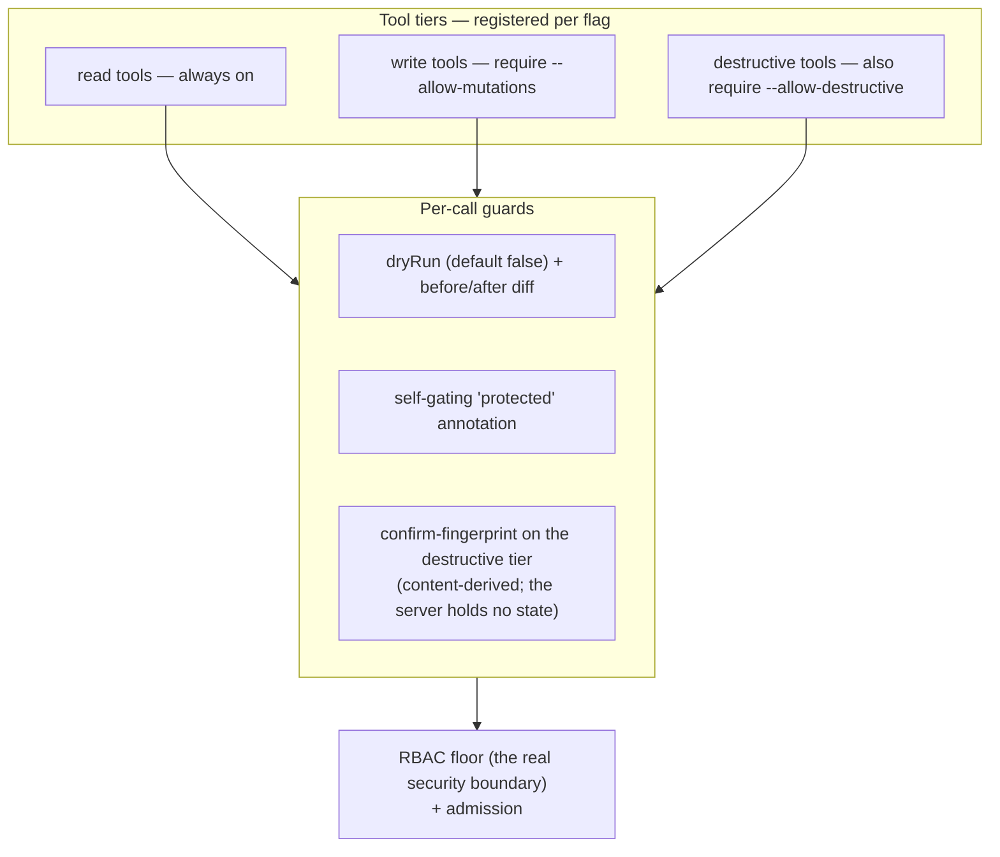

# ray-mcp — Architecture

How ray-mcp is put together: the layers, the ports, the data flows, and what is
built today vs. designed for later. The authoritative design is
[`docs/specs/ray-mcp-design.md`](specs/ray-mcp-design.md); this document is the
navigable, diagram-first companion. When they disagree, the spec wins.

## What ray-mcp is

ray-mcp is a Go [MCP](https://modelcontextprotocol.io) server that lets an AI
agent operate [Ray](https://www.ray.io/) on Kubernetes. It has two planes:

1. **The guarded CRD path** — manage RayCluster / RayJob / RayService through the
   [KubeRay](https://github.com/ray-project/kuberay) Custom Resources, with
   server-side apply, dry-run, diffs, and tiered safety gates.
2. **The "wedge" (the differentiator)** — a *read-only* reach into Ray's
   dashboard / job-submission REST API on the head node, for the live runtime
   detail the CRDs do not expose (real job status, logs). A generic Kubernetes MCP
   cannot see this.

The consumer is an LLM with a finite context budget, so every output is bounded
by design (compact list rows, distilled status, byte-capped logs).

## Architectural style: hexagonal (ports & adapters)

The domain is the center and depends on **interfaces**, never on Kubernetes or
HTTP. Only adapters at the edge touch the outside world. This keeps the domain
unit-testable with fakes and confines every external SDK to one place.



**The dependency rule:** arrows of *dependency* point inward. The domain defines
the port interfaces; adapters depend on the domain to implement them. The domain
imports neither `k8s.io/*` nor `net/http` — enforced in CI by an import check
(`go list -deps ./internal/domain` must not pull those).

## Package layout

```
cmd/ray-mcp/main.go              # entrypoint: config → adapter → server → transport
internal/
  config/                        # flag/env parsing + boot invariants (no cluster)
  mcp/                           # tool registration, schemas, arg↔DTO mapping (go-sdk)
  domain/                        # ports, DTOs, errors, services — NO k8s/http imports
  adapters/
    kuberay/                     # controller-runtime client (read path built)
    rayapi/                      # dashboard/job REST client, read-only (planned)
    reachability/                # DirectDial + PortForward strategies (planned)
  transport/                     # stdio (built); HTTP (planned)
  observability/                 # structured logging + mutation audit (planned)
  version/                       # build-time version constants
test/e2e/                        # real kind + KubeRay smoke tests (-tags e2e)
examples/                        # sample RayCluster manifest
hack/                            # version pins (KubeRay + envtest K8s)
```

### Import direction (the hexagon, concretely)



`internal/domain` (highlighted) sits at the bottom of the import graph and pulls
**only the standard library**. Everything Kubernetes-shaped lives in
`internal/adapters/kuberay`; everything MCP-protocol-shaped lives in `internal/mcp`
and `internal/transport`.

## The three ports

The domain depends on exactly three interfaces (`internal/domain/ports.go`). Each
method takes a `context.Context` (all calls are deadline-driven).

| Port | Role | Methods (v1 surface) | Status |
|------|------|----------------------|--------|
| **`KubeRayPort`** | The guarded CRD path | per-kind `List*`/`Get*`; a unified `Apply` (SSA, `dryRun`→DryRunAll); `Delete`; `Events` | RayCluster **read built**; write/delete/events + jobs/services planned |
| **`RayAPIPort`** | The wedge — Ray dashboard/job REST | `JobStatus`, `JobLogs` **only** | planned |
| **`RayReachability`** | How to reach the head dashboard | `Endpoint(ns, cluster, port)` | planned |

**`RayAPIPort` is read-only by construction.** It has *no* submit/stop/delete
method, and that absence *is* the contract: the Ray dashboard is unauthenticated
by default (the "ShadowRay" RCE surface), so ray-mcp consumes it read-only and
never exposes it as a write vector. Every mutation goes through the guarded CRD
path (`KubeRayPort`), not here.

## Data flow — a built tool call (`ray_cluster_list`)

This is the path exercised today, including the **lazy dial**: the server boots
without a cluster, and the controller-runtime client is built on the first
cluster-touching call.



Notes:
- **Token economy (spec §10):** list returns tiny rows + a real k8s `continue`
  token; never a silent truncation, never a fabricated total (k8s does not return
  one — `MoreAvailable` is derived from the continue token's presence).
- **Error mapping:** the adapter maps `apierrors.IsNotFound/IsForbidden/...` to the
  domain taxonomy (`NotFoundError`, `ForbiddenError`, `ConflictError`,
  `TimeoutError`). The MCP layer renders those as clean tool errors — never a raw
  k8s dump.
- **`ray_capabilities`** is the one tool that needs no cluster: it answers from
  config + build constants, so it works even when no kubeconfig resolves.

## Data flow — the wedge (designed, not yet built)

The differentiator. A Ray job runs minutes-to-hours, but MCP calls have a ~60s
client timeout, so **submit never blocks** and **waiting is a separate, bounded
tool**. Every wedge read is **two-phase**: poll the CRD until KubeRay populates
`status.jobId` (the Ray submission id), *then* dial the dashboard.



If the dashboard is unreachable, the wedge **degrades gracefully**: it still
returns CRD-derived status, annotated that live Ray detail was unavailable and
why. Tunnels are pooled per `(namespace, cluster)` with an idle reaper.

## The apply pipeline (designed — write path)

Every mutation flows through one pipeline so create/update/scale/deploy share the
same correctness and safety machinery:



Key invariants: the merged object stays **unstructured** (so fields newer than the
compiled KubeRay baseline are not dropped by a typed round-trip); `rawSpec` wins
on any key collision; SSA respects the autoscaler's ownership of `replicas`.

## Safety model (designed)

Layered, and gated at tool-registration time so disabled capabilities are never
even advertised to the agent:



The server is **stateless** — confirmations are content-derived fingerprints, not
server-issued tokens, so the HTTP deployment stays horizontally scalable.

## Configuration & transports

- **Config** (`internal/config`): `flags > environment > defaults`. Boot
  invariants validated with no cluster — notably the bind/auth rule: a non-loopback
  HTTP bind requires a token (or TokenReview mode), else the process refuses to
  boot. No `--insecure` escape hatch.
- **stdio** (built, primary): stdout *is* the JSON-RPC wire, so all logs/audit go
  to stderr or a file — never stdout. The README quickstart and the wedge delivery
  ride on stdio.
- **streamable HTTP + auth** (planned): a self-hosted shared-team instance; static
  bearer or Kubernetes TokenReview; TLS terminated at ingress/mesh, not in-binary.

## Testing architecture

A five-tier pyramid (full rationale:
[`docs/specs/ray-mcp-testing-strategy.md`](specs/ray-mcp-testing-strategy.md)).
The fast loop needs no Docker; build tags isolate the heavier tiers.

| Tier | Substrate | Build tag | Proves |
|------|-----------|-----------|--------|
| Unit | fakes (the ports) | none | domain logic: mapping, pagination, verbosity, guards |
| Adapter (KubeRay) | `envtest` (apiserver+etcd, **no operator**) | `envtest` | SSA, DryRunAll, CR storage, status→DTO mapping |
| Adapter (dashboard) | `httptest` | none | read-only REST client (planned) |
| MCP | go-sdk in-memory transport | none | tool schemas, arg validation, end-to-end tool calls |
| E2e | **kind + real KubeRay operator + pods** | `e2e` | the wedge for real; only tier with a reconciling cluster |

Because tiers 2–4 are blind to the wedge end-to-end (no operator, faked
dashboard), the kind+KubeRay e2e tier is the truth gate for the differentiator —
run as a pre-push capstone, not in the per-save loop.

## Build status snapshot

| Area | Status |
|------|--------|
| Config layer + boot invariants | ✅ built |
| Domain ports / DTOs / error taxonomy / fakes | ✅ built |
| MCP server + stdio transport | ✅ built |
| `ray_capabilities` | ✅ built |
| KubeRay adapter — RayCluster read (List/Get, status mapping, lazy dial) | ✅ built |
| `ray_cluster_list` / `ray_cluster_get` | ✅ built |
| Test harness (5 tiers; envtest + kind e2e proven) | ✅ built |
| `ray_cluster_events` | ⏳ next |
| Apply pipeline + RayCluster write/scale/delete | 🔭 designed |
| The wedge: rayapi + reachability adapters, job tools | 🔭 designed |
| RayService tools | 🔭 designed |
| HTTP transport + auth | 🔭 designed |

For the task-by-task plan see `tasks/plan.md` (in the source tree); for hands-on
setup see [`INSTALL.md`](INSTALL.md) and
[`TRY-IT-WITH-CLAUDE-CODE.md`](TRY-IT-WITH-CLAUDE-CODE.md).
