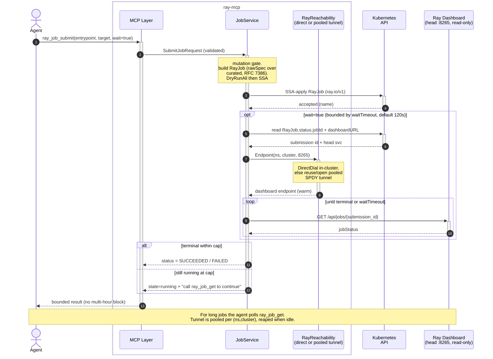

# ray-mcp — Design Specification

**Date:** 2026-06-13
**Status:** Draft for review
**Repo:** `github.com/risjai/ray-mcp`
**Incorporates:** grilling decisions Q1–Q5 (see `2026-06-13-ray-mcp-grilling-decisions.md`)

## 1. Summary

`ray-mcp` is a Model Context Protocol (MCP) server, written in Go, that lets an
AI agent manage Ray workloads running on Kubernetes via the
[KubeRay](https://github.com/ray-project/kuberay) operator. It exposes tools to
manage the full lifecycle of `RayCluster`, `RayJob`, and `RayService` resources,
**and** — this is the point — to reach Ray's own dashboard/job API for the
runtime detail (live job status, logs, follow-to-completion) that the Kubernetes
CRDs do not expose.

**Ambition (Q1).** The goal is to become **the default open-source KubeRay MCP
server** — not a personal tool or a learning exercise. That raises the bar on
adoption, alignment, and maintenance, not just code quality. It is self-hosted
per-user: a user runs their own instance next to their own cluster, using their
own Kubernetes credentials. The survival/alignment strategy that backs this
ambition is in §16.

## 2. Why this exists (the wedge)

**Null alternative.** A generic `apiVersion`+`kind` Kubernetes MCP server can
already create/get/delete arbitrary CRDs, including KubeRay's. So `ray-mcp` only
earns its existence where a generic tool **cannot** serve the agent, or serves
it so unreliably that it effectively can't. Everything in this spec is justified
against that bar.

**Why it doesn't exist yet (research-grounded, 17 sources, 23/25 claims
adversarially confirmed).** There is no official ray-project/Anyscale MCP server
for KubeRay CRD lifecycle and no dominant community one. Anyscale deliberately
chose a non-MCP path (first-party "Agent Skills"); in their docs MCP appears only
as *a workload you host on Ray Serve*, never as a Ray control plane — the
best-resourced potential incumbent walked the other way. Existing Ray MCP servers
hit the wrong layer (read-only dashboard tools, or Ray *core* API via
`ray.init()`/`JobSubmissionClient`, not CRDs) and are near-zero-star/abandoned.
Generic K8s MCP servers (~1k–1.4k★) CRUD Ray CRDs but with **zero Ray-aware
semantics** — that is the thing to beat. The gap is real and largely uncontested.

### Hard moat — a generic K8s tool *structurally cannot* do this

These require talking to the Ray dashboard/job API on the head node (port 8265),
reached via an on-demand port-forward. The data does not live in the CRD, so no
amount of CRD access or prompt-engineering gets a generic tool there:

- **Tail job logs.** "Tail the last 200 lines of job `raysubmit_abc` on cluster
  `nightly-train`." Logs live in the Ray dashboard, not in `RayJob.status`.
- **Submit → know when it finishes.** "Submit this entrypoint and tell me when
  it actually succeeds/fails." This spans RayJob CRD creation **and** dashboard
  job-status polling — two control planes in one logical operation. (Mechanism is
  async-over-sync, not a multi-hour blocking call — see §7.A.)
- **Live runtime status.** Actor/task/resource detail surfaced by the dashboard
  that the CRD status never carries.

This cross-plane path (read-only RayAPI client + reachability strategy) is the
**core differentiator**, not a secondary feature. The implementation must nail
it. Note the dashboard/Job API is **unauthenticated and RCE-capable** (ShadowRay),
so `ray-mcp` consumes it strictly read-only (Q6, §8) and reaches it via
in-cluster DNS or an SPDY tunnel depending on where the server runs.

### Soft moat — a generic tool *can*, but agents get it wrong

A generic tool can do these via raw spec surgery; the value here is that
`ray-mcp` makes them typed, reliable, and self-explaining — and deep nested
KubeRay specs are exactly where agents fail:

- **Typed worker-group autoscaling** (min/max/replicas per group) as first-class
  params, not hand-built spec paths.
- **RayService reconfig awareness.** KubeRay has *two distinct* update paths and
  an agent must not confuse them: editing `serveConfigV2` is an **in-place** update
  to Serve apps on the existing cluster, whereas editing the cluster config (e.g.
  `rayVersion`) triggers a **zero-downtime cluster swap** (KubeRay stands up a
  pending cluster, waits, switches head-service traffic, deletes the old one).
  `ray-mcp` knows which path a given change takes and reports it; a generic tool
  patching raw YAML does not.
- **Pre-apply pruning prediction (Q4).** Structural-schema CRDs make the K8s API
  server **silently prune fields the installed CRD schema doesn't know** — no
  error; the agent thinks it worked. Because `ray-mcp` reads the installed Ray CRD
  schema, it can warn *before* applying that a field will be dropped. This is
  Ray-aware safety a generic K8s MCP server does not attempt.
- **Ray-tuned destructive guards** for operations whose danger is Ray-specific:
  scaling a worker group to zero, deleting a RayService that is serving traffic.

The hard moat is the reason to build; the soft moat is why it stays pleasant to
use. Distribution polish (§12) is justified by, and sequenced after, the wedge.

## 3. Goals & Non-Goals

### Goals
- Serve the **hard-moat** operations first: live job status, logs, and
  submit-then-follow-to-completion (async-over-sync, §7.A) across the CRD and
  dashboard APIs.
- Let an agent perform full lifecycle operations (read + write) on RayCluster,
  RayJob, and RayService through a small, well-typed set of MCP tools.
- Be Kubernetes-native **and KubeRay-native**: manage Ray via KubeRay CRDs using
  the KubeRay Go types, so the project reads like something ray-project could
  adopt (§16).
- Be safe by default for a tool that any autonomous agent might drive.
- Be trivial to "hook up": run locally against a kubeconfig (stdio) and drop
  into an agent's MCP config.
- **Sequence wedge → polish.** The wedge and its tests land before heavy
  *release-engineering* machinery (multi-arch pipeline, distroless hardening).
  *Cheap* adoption hedges (Apache-2.0, KubeRay-native naming, an MCP-registry
  listing, a donation-ready README) are not deferred — they cost little
  (§12/§16). Note (Q7): HTTP transport + Helm are **not** in the deferred bucket —
  see Non-Goals and §12.

### Non-Goals (v1)
- No hosted multi-tenant service; no storage of other users' cluster
  credentials. (HTTP transport in v1 is for a *self-hosted shared-team instance*,
  Q7 — not a hosted service.)
- **No Ray-side write surface.** The dashboard/Job REST API is consumed
  **read-only** (live status + logs); every mutation goes through the guarded CRD
  path (Q6). `ray_job_stop` is therefore **deferred from v1** (it was the only
  Ray-side write candidate; the heavier CRD `spec.suspend` route is future work).
- No multi-cluster fan-out (one server instance binds to one Kubernetes
  context).
- No management of the KubeRay operator's own installation/lifecycle.
- No true real-time log streaming (v1 returns a bounded tail).
- No provisioning of the underlying Kubernetes cluster or node pools.
- No in-server PodSecurity policy on `rawSpec` (delegated to RBAC + admission, §8).
- No TLS termination inside the binary — pushed to ingress/mesh (Q8, §9).

## 4. Key Decisions

| # | Decision | Choice | v1? |
|---|----------|--------|-----|
| 1 | Deployment model | Self-hosted, per-user; ambition = default OSS KubeRay MCP server (Q1) | yes (binary only) |
| 2 | Transport | **Both stdio + streamable HTTP in v1** (Q7). stdio = primary/must-be-flawless (wedge-delivery, README quickstart); HTTP = secondary self-hosted shared-team instance, security designed-in not bolted-on | yes |
| 3 | Control plane | KubeRay CRDs **and** Ray dashboard/job API as **co-core** (cross-plane path is the wedge) | yes |
| 4 | Operation surface | Full lifecycle read+write, guarded (safe by default) | yes |
| 5 | Ray API reach | **Auto-detected reachability strategy** (Q6): DirectDial in-cluster vs SPDY PortForward out-of-cluster (`--ray-access=auto\|direct\|port-forward`). Dashboard/Job API consumed **read-only by construction**. Pooled tunnel per (ns,cluster) + idle reaper. **Core to the wedge** | yes |
| 6 | Scope | Single cluster (one context), multi-namespace | yes |
| 7 | HTTP auth | **Non-loopback bind ⇒ token mandatory, no bypass** (Q8; `--insecure` killed). Default bind `127.0.0.1`. Static bearer (default) + K8s **TokenReview** (opt-in, built in v1). TLS to ingress/mesh. Audit-log every mutation | yes |
| 8 | K8s client | controller-runtime **client package** (`pkg/client`, uncached, direct-to-API) + KubeRay Go types/scheme (`ray-operator/apis/ray/v1`); SSA (`client.Apply`) + `DryRunAll`. NOT the manager framework, NOT the generated clientset (Q3) | yes |
| 9 | MCP SDK | Official `github.com/modelcontextprotocol/go-sdk` (**GA, v1.x**; stdio + streamable-HTTP transports) | yes |
| 10 | Spec input | Curated typed params + `rawSpec` escape hatch via **RFC 7386 JSON Merge Patch, rawSpec-over-curated (rawSpec wins)**, arrays replace wholesale, identity-guarded, applied **unstructured**; `--allow-raw-spec` gate (Q5) | yes |
| 11 | Safety model | Layered: tier flags + dryRun + protected annotation + diffs + RBAC floor | yes |
| 12 | KubeRay version | `ray.io/v1` only (no v1alpha1); compile against latest GA KubeRay at first commit (v1.5.x as of 2026-06), bump deliberately; **read the installed Ray CRD schema** for pruning prediction + best-effort version; CI-tested range in README (Q4) | yes |
| 13 | Logs | Bounded tail (last-N-lines / since-duration), not streaming | yes |

## 5. Architecture

Layered hexagonal (ports & adapters). Data flows top→down; only adapters touch
the outside world. The domain layer imports no Kubernetes or HTTP packages —
it depends on Go interfaces — which makes it unit-testable with fakes.

```
┌──────────────────────────────────────────────────────────────┐
│ Transport (edge)   stdio (primary)  │  streamable HTTP (+auth) │
├──────────────────────────────────────────────────────────────┤
│ MCP layer  (modelcontextprotocol/go-sdk)                       │
│   • tool registration + JSON schemas                           │
│   • arg decode/validate ⇄ domain DTOs                          │
│   • result/error formatting (text + structured content)        │
├──────────────────────────────────────────────────────────────┤
│ Domain / service layer   (no k8s/http imports)                 │
│   • ClusterService · JobService · ServiceService               │
│   • safety guards: mutation gate, destructive gate, dryRun,    │
│     protected-annotation, before/after diff                    │
│   • unified apply pipeline: curated base + rawSpec (RFC 7386,  │
│     rawSpec wins) → unstructured → DryRunAll → SSA (§7.C)       │
│   • orchestration: submit → bounded-wait/poll across both APIs │
├──────────────────────────────────────────────────────────────┤
│ Adapters (ports)                                               │
│   ├─ KubeRayClient   (ctrl-runtime client pkg, uncached;       │
│   │                   SSA + DryRunAll; reads Ray CRD schema)    │
│   ├─ RayAPIClient    (dashboard/job REST, READ-ONLY) ★ wedge    │
│   └─ RayReachability  ┬ DirectDial    (in-cluster DNS)   ★      │
│                       └ PortForward   (SPDY, out-of-cluster) ★  │
├──────────────────────────────────────────────────────────────┤
│ Kubernetes API server  +  Ray head dashboard (in-cluster)      │
└──────────────────────────────────────────────────────────────┘
★ = core to the wedge (§2); a generic K8s MCP cannot reach this.
```

### Boundaries
- **Domain depends on interfaces**, `KubeRayPort` and `RayAPIPort`, not on
  concrete clients. Fakes drive the bulk of the tests.
- **Transport and SDK are edges.** v1 ships **both** stdio (primary) and
  streamable HTTP (Q7); the domain/adapters are identical across transports.
- **The dashboard/Job API is read-only by construction (Q6).** `RayAPIPort` has
  **no write methods** — live status + logs only. Every mutation goes through the
  guarded CRD path, so the unauthenticated Ray dashboard (ShadowRay RCE surface)
  is never a write vector through this tool.
- **One instance = one Kubernetes context**, bound at startup; multi-namespace
  within that context.
- **Reachability is a strategy (Q6).** A `RayReachability` port with two adapters
  — `DirectDial` (in-cluster, via cluster DNS, no `pods/portforward` RBAC) and
  `PortForward` (SPDY, out-of-cluster) — selected by `--ray-access=auto|direct|
  port-forward` (`auto` detects in-cluster config). Tunnels are **pooled per
  (namespace, cluster) with an idle-timeout reaper** (not per-call), re-dialed on
  next use if dropped. No tool call blocks on a tunnel for a job's lifetime
  (§7.A), but tunnels are reused across calls within their idle window.
- **KubeRayClient is the controller-runtime client package** (uncached,
  direct-to-API-server) — we are a client, not a controller: no
  cache/reconcile/leader-election/webhooks. All mutations go through **Server-Side
  Apply** with a dedicated field manager (so the autoscaler's ownership of
  `replicas` is respected, not clobbered — §7.D), always preceded by `DryRunAll`.

### Package layout
```
cmd/ray-mcp/main.go              # flag parsing, wiring, transport selection
internal/config/                 # config struct, flag/env loading, validation
internal/mcp/                    # tool registration, schemas, arg↔DTO mapping
internal/domain/                 # services, guards, apply pipeline (pure-ish)
  cluster.go  job.go  service.go  guards.go  apply.go  diff.go  types.go
internal/adapters/kuberay/       # controller-runtime client impl (SSA + schema read)
internal/adapters/rayapi/        # dashboard/job REST client (read-only) ★ wedge
internal/adapters/reachability/  # DirectDial + PortForward strategies   ★ wedge
internal/observability/          # structured logging + mutation audit log
```

## 6. Tool Surface

Tools are namespaced `ray_*`. Read tools are always registered. Write tools
register only when `--allow-mutations` is set; destructive tools additionally
require `--allow-destructive`. Disabled tools are not advertised to the agent.
Every tool takes an optional `namespace` arg, defaulting to the configured
default namespace. Tools marked ★ depend on the wedge (dashboard API + tunnel).

### RayCluster
| Tool | Tier | Purpose |
|------|------|---------|
| `ray_cluster_list` | read | List RayClusters (+ ready/replicas/endpoints) |
| `ray_cluster_get` | read | Full status, conditions, head/worker detail |
| `ray_cluster_events` | read | Recent k8s events for the cluster's pods |
| `ray_cluster_create` | write | Create via the unified apply pipeline (§7.C), `dryRun` |
| `ray_cluster_update` | write | Patch image/resources/replicas/autoscaling via SSA, `dryRun`, diff |
| `ray_cluster_scale` | write | Scale a worker group min/max/replicas via SSA, `dryRun`, diff |
| `ray_cluster_delete` | destructive | Delete (honors `protected`), `dryRun` |

### RayJob
| Tool | Tier | Purpose |
|------|------|---------|
| `ray_job_list` | read | List RayJobs (+ deployment/job status) |
| `ray_job_get` | read ★ | Status incl. live dashboard job status, start/end, message |
| `ray_job_logs` | read ★ | Bounded tail of job logs via Ray Job API (over tunnel) |
| `ray_job_submit` | write ★ | entrypoint + runtimeEnv + cluster target (see below); optional bounded `wait` (then follow via `ray_job_get`); `dryRun`. Creates a RayJob *CRD* (guarded CRD path) — not a Ray-side write |
| `ray_job_delete` | destructive | Delete the RayJob resource |

> **`ray_job_stop` is deferred from v1 (Q6).** It was the only Ray-side write
> candidate, and v1 keeps the dashboard API read-only by construction. The
> CRD-native alternative (`spec.suspend`, which can tear the cluster down) is
> heavier and deferred rather than rushed. v1 RayJob surface: `list`/`get`/`logs`
> (read) + `submit` (write, CRD) + `delete` (destructive).

**Job identity.** The agent always refers to a job by its **RayJob k8s name**.
The Ray dashboard/job REST API is keyed by the **submission id** (the
`raysubmit_...` handle, used for status/logs/stop). KubeRay surfaces that handle
on the RayJob as **`status.jobId`** (this field *is* the submission id — there is
no separate `submissionId` field), alongside **`status.dashboardURL`**,
**`status.jobStatus`**, and **`status.jobDeploymentStatus`**. The service bridges
name → submission id + dashboard endpoint via those status fields. If status is
not yet populated (job not scheduled yet), wedge tools return a clear "job not yet
scheduled" message rather than a tunnel/connection error. The agent never has to
know the submission id exists.

**Cluster target (R8 — resolved: both modes, explicit and mutually exclusive).**
A RayJob either runs against an existing cluster or brings its own. `ray_job_submit`
takes exactly one of:
- `targetCluster: <name>` — run against an **existing** RayCluster (maps to the
  RayJob `spec.clusterSelector`); no cluster is created or deleted by the job.
- `clusterSpec: {curated params + rawSpec}` — maps to RayJob
  `spec.rayClusterSpec`; KubeRay creates an **ephemeral** cluster for the job and
  tears it down on completion via `spec.shutdownAfterJobFinishes=true`.

Supplying both, or neither, is a validation error. Because `clusterSpec` *creates
a cluster* via a "submit job" call, it is gated behind `--allow-mutations` like any
create, and the response states plainly that an ephemeral cluster will be / was
created.

### RayService
| Tool | Tier | Purpose |
|------|------|---------|
| `ray_service_list` | read | List RayServices (+ serve status, healthy replicas) |
| `ray_service_get` | read | Serve app status, route prefix, conditions |
| `ray_service_deploy` | write | Create via the unified apply pipeline (serveConfigV2 + cluster params + `rawSpec`), `dryRun` |
| `ray_service_update` | write | Update `serveConfigV2` (in-place) or cluster config (zero-downtime swap); reports which path the change takes; `dryRun`, diff |
| `ray_service_delete` | destructive | Delete (honors `protected`; refuses if serving traffic unless forced) |

### Meta
| Tool | Tier | Purpose |
|------|------|---------|
| `ray_capabilities` | read | Server version, bound context, default ns, enabled tiers, **and (from the installed Ray CRD schema, Q4): valid field set per CRD → pruning-prediction availability, best-effort `crdVersion` (`app.kubernetes.io/version` label or served API version, else `"unknown (insufficient RBAC)"`), and the CI-tested KubeRay range** |

### Curated create params (shared shape)
`name`, `namespace`, `rayVersion`, `image`,
`headResources{cpu,memory,gpu}`,
`workerGroups[]{name,replicas,min,max,resources}`,
`enableAutoscaling`, `labels`, `annotations`,
plus `rawSpec` (YAML/JSON, merged **over** the curated base — see below).

**`rawSpec` is the deliberate escape hatch (Q5 — rawSpec wins).** Curated params
are the convenient common-case shape; `rawSpec` is the power-user scalpel and it
**takes precedence**. Mechanics (the unified apply pipeline, §7.C): the curated
params form the **base**, `rawSpec` is applied over it as an **RFC 7386 JSON Merge
Patch (rawSpec wins on any key collision)**, **arrays replace wholesale** (set
`workerGroups` in `rawSpec` and you own the entire list — documented loudly), and
an **identity guard** rejects any merged result that changes `name`/`namespace`
away from the tool args. The merged object stays **unstructured** so fields newer
than the compiled KubeRay baseline survive (they would be dropped by a typed
round-trip). Gated by **`--allow-raw-spec` (default `true`)**; setting it `false`
removes the `rawSpec` arg from every tool schema entirely — curated-params-only
hard mode for autonomous agents. Security boundary is RBAC + admission, not an
in-server field policy (§8).

## 7. Data Flow

### A) `ray_job_submit` → completion (the wedge, cross-plane, async-over-sync)

MCP tool calls are request/response; a Ray job can run for hours. We therefore
**never** block a tool call (or hold a tunnel) for the lifetime of a job. Instead
we use the standard async-over-sync pattern: submit returns fast, a bounded wait
is best-effort, and the agent loops on `get` to follow long jobs.

1. MCP layer decodes args → `SubmitJobRequest` DTO; schema validation up front.
2. `JobService.Submit`: mutation gate → build the RayJob via the unified apply
   pipeline (§7.C: curated base, `rawSpec` merged over it, rawSpec wins) →
   `DryRunAll` → SSA-apply. Returns the RayJob **name** immediately.
3. If `wait=true` (default false): do a **bounded** wait capped by `waitTimeout`
   (default 120s). Within that window, open an ephemeral tunnel for *this call
   only* and poll dashboard job status.
4. Return one of: terminal status (succeeded/failed), or — if the cap is hit while
   still running — `{state: running, name, jobId, message: "still running; call
   ray_job_get to continue"}`. The agent follows long jobs by polling
   `ray_job_get`. Optional MCP progress notifications may be emitted during the
   bounded wait, but correctness never depends on the client handling them.

**Tunnel lifecycle (Q6):** reachability is resolved via the `RayReachability`
strategy — `DirectDial` when in-cluster (no tunnel at all), `PortForward` (SPDY)
when out-of-cluster. Tunnels are **pooled per (namespace, cluster) with an
idle-timeout reaper**, reused across calls within the idle window and re-dialed on
next use if dropped. Crucially, no tool call blocks on a tunnel for a *job's*
lifetime — the bounded-wait loop above still returns fast; pooling only avoids
re-establishing a tunnel on every status/logs call. On a mid-call failure
(e.g. head pod rescheduled), re-dial once; if still unreachable, degrade
gracefully per §10.



### B) `ray_job_logs` (the wedge, dashboard API path — read-only)
1. `JobService.Logs`: resolve RayJob → submission id (`status.jobId`) + head
   service via KubeRay client.
2. `RayReachability.Endpoint(ns, cluster, 8265)` → either a direct in-cluster URL
   (`DirectDial`) or a pooled SPDY tunnel (`PortForward`). (8265 is the dashboard
   / Job Submission REST API port.) The endpoint is reused from the pool if warm.
3. `RayAPIClient.JobLogs(submissionID)` → `GET /api/jobs/{submission_id}/logs` →
   bounded tail → text. The client exposes **only read endpoints** —
   `GET /api/jobs/{id}` (status) and `.../logs` — no submit/stop methods exist on
   `RayAPIPort` (Q6); job creation happens on the CRD path, not here.
4. The pooled tunnel is left warm for the idle window (reaped later), not closed
   per-call.

### C) The unified apply pipeline (shared by create / update / deploy) — Q5

One pipeline backs every mutating CRD tool. It unifies SSA (Q3), pruning
detection (Q4), the `rawSpec` merge (#10), and the diff (#11):

1. Curated params → typed KubeRay object → marshal to JSON (**base**).
2. `rawSpec` (YAML or JSON) → JSON.
3. **RFC 7386 JSON Merge Patch**, `rawSpec` over base (**rawSpec wins**); arrays
   replace wholesale.
4. **Identity guard:** if the merged result changes `name`/`namespace` away from
   the tool-arg identity → **error**, not silent ignore.
5. Keep the result **unstructured** (preserves fields newer than the compiled
   baseline — the wedge). Validation is **server-side**, not a client typed
   round-trip.
6. **Always `DryRunAll`** the unstructured object → the API server validates it
   against the *installed* CRD schema → reveals pruning (Q4) and lets us diff
   intent-vs-result.
7. If not `dryRun`: **SSA-apply** the unstructured object with our field manager →
   read back → field-level diff (§10). A typed unmarshal MAY run for diagnostic
   warnings only; it must NOT drop applied fields.

### D) `ray_cluster_update` / `ray_cluster_scale` (concurrency-safe via SSA)

Worker replica counts on an autoscaling cluster are **live, contended fields** —
the Ray autoscaler writes `replicas` directly on the RayCluster CR (incrementing
on scale-up, and reducing it plus populating `workersToDelete` on scale-down), and
another agent might write too. A naive get→modify→put races and silently clobbers
those autoscaler writes (classic Kubernetes lost update; worst-case on an
autoscaling cluster). [verified: KubeRay autoscaling docs]

1. Mutation gate → resolve target by name.
2. Apply via the §7.C pipeline using **Server-Side Apply with our own field
   manager**, sending **only the fields we intend to own**. SSA field-ownership
   means we do not take over autoscaler-owned fields: `scale` applies the named
   worker group's `replicas`/`minReplicas`/`maxReplicas`; on an autoscaling
   cluster we surface a warning and do not force-apply `replicas` it doesn't own.
3. On `Conflict` (a field genuinely co-owned): surface a clear conflict error;
   retry once only when the change is ours to make.
4. Return a **field-level diff** (see §10 output contract), not the whole object.

## 8. Safety Model

Layered defense-in-depth; never relies on the agent behaving well.

- **Tier gating at registration.** read always on; write needs `--allow-mutations`;
  destructive needs `--allow-destructive`. Disabled tools are not advertised.
- **`dryRun` arg** on every mutating tool → `DryRunAll` / diff only, no mutation.
- **Protected annotation.** `ray-mcp/protected="true"` on a resource makes delete
  and destructive scale-down refuse with a clear message, regardless of flags.
- **Ray-tuned destructive guards.** Scaling a worker group to zero and deleting a
  RayService that is actively serving traffic are treated as destructive and
  guarded accordingly (refuse-unless-forced + clear impact message).
- **Before/after diff** returned by every successful mutation (structured +
  human-readable).
- **Read-only dashboard invariant (Q6).** The Ray dashboard/Job API is
  unauthenticated and RCE-capable (ShadowRay). `RayAPIPort` therefore exposes
  **no write methods** — the tunnel can never be a mutation vector through this
  tool; all writes are CRD-path, RBAC-gated.
- **Audit log every mutating call (Q8).** Caller identity (static-token
  fingerprint or TokenReview SA username), tool, args summary, `dryRun` flag, and
  outcome — so "what did the agent do?" is always answerable. Not optional polish.
- **The HTTP token gates *reach*, not *privilege* (Q8).** Once past the token the
  server acts with its **own SA's RBAC**; that SA's RBAC is the real privilege
  boundary. Scope it tightly; the token must be strong and is mandatory on any
  non-loopback bind.
- **`rawSpec` security boundary (Q5) — bounded by RBAC + admission, no in-server
  field policy.** `rawSpec` reaches the full PodTemplateSpec (privileged,
  hostPath, hostNetwork, serviceAccountName, arbitrary images). We deliberately do
  **not** reinvent PodSecurity in the server: self-hosted + per-user means the
  user's own RBAC is the floor, and pod-spec policy is the job of PodSecurity
  admission / Kyverno / Gatekeeper. For autonomous agents, use restrictive RBAC
  and/or admission, or set `--allow-raw-spec=false` (curated-only hard mode).
  *Considered and rejected for v1:* a built-in denylist of scary fields — it would
  be a worse copy of PodSecurity admission.
- **RBAC is the floor (Q4 shape).** App guards layer on top of whatever the
  kubeconfig/SA permits. Shipped RBAC = a **namespace `Role`** (the Ray CRDs +
  pods/events/services/portforward it needs) **plus a small cluster-scoped
  `ClusterRole`** granting `get customresourcedefinitions` restricted via
  `resourceNames: [rayclusters.ray.io, rayjobs.ray.io, rayservices.ray.io]` (for
  schema read / pruning prediction). The ClusterRole is **use-if-present**: if the
  SA lacks it, `ray-mcp` degrades gracefully (`crdVersion: "unknown (insufficient
  RBAC)"`, falls back to post-apply read-back diff). README keeps a least-privilege
  story: "namespace Role + read 3 named Ray CRDs cluster-scoped."

## 9. Configuration

Precedence: flags > environment > defaults. Both transports and their flags are
wired in v1 (Q7/Q8).

| Flag | Env | Default | Purpose | v1? |
|------|-----|---------|---------|-----|
| `--transport` | `RAY_MCP_TRANSPORT` | `stdio` | `stdio` (primary) or `http` | yes |
| `--context` | `RAY_MCP_CONTEXT` | current context | Kubeconfig context to bind | yes |
| `--kubeconfig` | `KUBECONFIG` | discovery / in-cluster SA | Credentials source | yes |
| `--default-namespace` | `RAY_MCP_NAMESPACE` | `default` | Namespace when a tool omits one | yes |
| `--allow-all-namespaces` | `RAY_MCP_ALL_NS` | `false` | Permit cluster-wide list | yes |
| `--ray-access` | `RAY_MCP_RAY_ACCESS` | `auto` | Reachability strategy: `auto`\|`direct`\|`port-forward` (Q6) | yes |
| `--allow-mutations` | `RAY_MCP_ALLOW_MUTATIONS` | `false` | Register write tools | yes |
| `--allow-destructive` | `RAY_MCP_ALLOW_DESTRUCTIVE` | `false` | Register destructive tools | yes |
| `--allow-raw-spec` | `RAY_MCP_ALLOW_RAW_SPEC` | `true` | When `false`, drop `rawSpec` from all tool schemas (curated-only hard mode) | yes |
| `--log-level` | `RAY_MCP_LOG_LEVEL` | `info` | Structured log level | yes |
| `--http-addr` | `RAY_MCP_HTTP_ADDR` | `127.0.0.1:8765` | HTTP listen address (`http` transport) | yes |
| `--auth-mode` | `RAY_MCP_AUTH_MODE` | `static` | HTTP auth: `static` bearer or `tokenreview` (K8s SA tokens, Q8) | yes |
| `--auth-token` | `RAY_MCP_AUTH_TOKEN` | (none) | Static bearer token. **Mandatory for any non-loopback bind**; no bypass flag (Q8) | yes |
| `--ray-dashboard-auth` | `RAY_MCP_RAY_DASH_AUTH` | (none) | Optional token/header passed through to a dashboard fronted by an auth proxy (off by default, Q6) | yes |

**Bind/auth invariant (Q8):** binding to a **non-loopback** address requires an
auth token (static) or `tokenreview` mode — the process **refuses to boot
otherwise**, with an explanatory error. There is no `--insecure` escape hatch.
The only tokenless case is a loopback bind, which the OS already gates. TLS is
terminated at ingress/mesh, not in the binary.

## 10. Error Handling & Output Contract

**The consumer is an LLM with a finite context budget, not a human scrolling a
terminal.** Every payload is bounded by design; unbounded output is a context
bomb that degrades the agent.

**Output contract (token-bounded):**
- **Diffs are field-level and summarized:** changed paths with old→new *scalar*
  values. Large nested subtrees are summarized, not inlined — e.g.
  "`workerGroups[0].template` changed (3 fields)" rather than dumping the pod
  template. An opt-in `verbose` arg returns the full diff when truly needed.
- **List tools paginate / cap** (default ~50 items) and report "N more
  available" rather than returning unbounded lists.
- **Logs** are already a bounded tail (decision #13).
- **Errors and events are truncated** to a bounded, relevant slice (e.g. last N
  events / the admission message), never the raw firehose.
- **Pruning warnings** (Q4) name the dropped field paths concisely.

**Errors:**
- Adapters return typed errors: `NotFound`, `Forbidden`, `Conflict`,
  `RayAPIUnreachable`, `Timeout`.
- Domain maps them to MCP tool errors with actionable, bounded messages (e.g.
  `Forbidden` names the missing RBAC verb/resource). Raw k8s/Ray API errors are
  never leaked verbatim.
- All calls are `context.Context`-driven with deadlines.
- Port-forward failures degrade gracefully: CRD-derived status is still
  returned, annotated that live Ray detail (the wedge) was unavailable and why.

## 11. Testing Strategy

- **Domain layer (bulk of coverage):** pure unit tests with fake `KubeRayPort`/
  `RayAPIPort`. Covers guards, the unified apply pipeline (RFC 7386 merge with
  rawSpec-wins, arrays-replace, identity guard, unstructured preservation), diff,
  tier logic, and the submit→bounded-wait→follow orchestration (§7.A). No cluster
  required.
- **KubeRay adapter:** `envtest` (controller-runtime's API-server-in-a-box) with
  KubeRay CRDs installed — exercises SSA, `DryRunAll`, and **pruning prediction**
  (apply an object with an unknown field, assert it is detected/dropped).
- **Ray API adapter:** `httptest` server mimicking the dashboard/job API
  (status + logs) — directly exercises the wedge logic without a live head node.
  Asserts `RayAPIPort` is **read-only** (no submit/stop methods exist; Q6).
- **Reachability (Q6):** unit-test strategy selection (`auto` in-cluster→Direct,
  else PortForward) and tunnel pooling/idle-reaping with a fake dialer.
- **HTTP auth (Q8):** assert the **boot invariant** — non-loopback bind without a
  token (static or tokenreview) refuses to start; loopback is allowed tokenless;
  TokenReview path validated against a fake reviewer.
- **MCP layer:** in-memory transport from go-sdk; assert tool schemas (including
  `rawSpec` absent when `--allow-raw-spec=false`, and `ray_job_stop` absent), arg
  validation, and end-to-end tool calls against fakes. Run across **both stdio and
  HTTP** transports.
- **Optional e2e:** kind + KubeRay smoke test behind a build tag / CI job.

## 12. Distribution

Wedge-first sequencing (§3): the **heavy** machinery is deferred until earned, but
the **cheap adoption hedges** ship from day one because they cost little and back
the "become the default" ambition (Q1/Q2, §16).

**v1 ships:**
- A plain `go install` / `go build` binary, speaking **both** stdio and HTTP (Q7).
- README: **stdio quickstart leads** (point at kubeconfig, drop into an agent's
  MCP config) — the primary adoption path; a secondary "shared team instance"
  section covers the HTTP transport, its mandatory-token invariant, and TLS via
  ingress. Documents the least-privilege RBAC (namespace `Role` + the small
  CRD-read `ClusterRole`, §8) and the **CI-tested KubeRay range** (e.g. "tested
  against v1.3–v1.5", Q4 — a tested promise, not a runtime-derived one).
  **The read-only default is called out loudly:** mutations are OFF until
  `--allow-mutations` (and destructive ops until `--allow-destructive`), so a
  first-time user doesn't read "my agent can't create anything" as a bug.
  `ray_capabilities` echoes the enabled tiers.
- **Helm chart** bundling the `Role` + CRD-read `ClusterRole`/bindings +
  ServiceAccount (its reason to exist is the in-cluster HTTP deployment, Q7).
- **Cheap adoption hedges (not deferred):** Apache-2.0, KubeRay-native naming, an
  MCP-registry listing, and a donation-ready README (§16).
- HTTP auth: **static bearer (default) + K8s TokenReview (opt-in)**, both built in
  v1 (Q8).
- CI: `golangci-lint` + unit + envtest on every PR.

**Deferred (add when earned):**
- GoReleaser multi-arch release pipeline.
- Distroless image hardening.
- `ray_job_stop` / CRD `spec.suspend` job-pause semantics (Q6).
- OAuth 2.1 resource-server flow (TokenReview already realizes the in-cluster
  identity story Q8 needed; OAuth only if external-IdP demand appears).

## 13. Verified Technical Facts (research-backed, 2026-06-13)

Load-bearing API claims were fact-checked against official Ray/KubeRay docs and
the SDK repo. Confirmed:

- **MCP Go SDK** `github.com/modelcontextprotocol/go-sdk` is official (with Google),
  **GA v1.x**, with `mcp.StdioTransport`, typed-schema `mcp.AddTool`, and
  `StreamableHTTPHandler`.
- **Ray dashboard / Job Submission REST API** on port **8265**; endpoints:
  `POST /api/jobs/` (submit), `GET /api/jobs/{id}` (status),
  `GET /api/jobs/{id}/logs` (logs), `POST /api/jobs/{id}/stop`. The `{id}` is the
  **submission id** (`raysubmit_...`).
- **`RayJob.status`** (`ray.io/v1`) exposes `jobId` (== submission id; no separate
  `submissionId` field), `dashboardURL`, `jobStatus`, `jobDeploymentStatus`.
- **RayJob targeting:** `spec.clusterSelector` (existing cluster) vs
  `spec.rayClusterSpec` (ephemeral) + `spec.shutdownAfterJobFinishes`.
  (`submissionMode` defaults to `K8sJobMode`.)
- **API group/version** `ray.io/v1` for RayCluster/RayJob/RayService.
- **Go client (Q3):** typed CRD types + scheme at
  `github.com/ray-project/kuberay/ray-operator/apis/ray/v1`, driven by the
  **controller-runtime client package** (`sigs.k8s.io/controller-runtime/pkg/client`,
  uncached). The generated clientset (`ray-operator/pkg/client/clientset/versioned`)
  exists but is **not** used — SSA + unstructured-merge ergonomics are better via
  the controller-runtime client. `apiserversdk` (KubeRay v1.4+, alpha) is a
  **server-side reverse proxy**, not a client lib — out of the client path; noted
  only as a future HTTP-deployment/alignment surface (§16).
- **Autoscaler writes `replicas`** (and `workersToDelete`) on the RayCluster CR →
  the lost-update risk in §7.D is real, and SSA field-ownership is the mitigation.
  (No doc *recommendation* against manual edits is claimed — only the mechanism.)
- **RayService:** `serveConfigV2` change = **in-place** Serve update; cluster-config
  change = **zero-downtime cluster swap**. Two different paths (§2, §6).
- **Structural-schema pruning (Q4):** the K8s API server silently prunes unknown
  fields against the installed CRD schema — the basis for reading the Ray CRD
  schema to predict pruning before applying.
- **Dashboard has no built-in auth (Q6):** the Ray dashboard / Job Submission API
  is unauthenticated by default — the basis of the "ShadowRay" unauthenticated-RCE
  attacks. This is why `ray-mcp` consumes it **read-only** and never exposes it as
  a write path. In-cluster reachability uses cluster DNS to the head service
  (`DirectDial`); out-of-cluster uses SPDY port-forward.
- **K8s TokenReview API (Q8):** lets a server validate a presented ServiceAccount
  token and obtain the caller's identity — the idiomatic in-cluster auth used for
  the opt-in `tokenreview` mode (cheaper than full OAuth for in-cluster).

## 14. Open Questions / Future Work

- Broader KubeRay version compatibility beyond the CI-tested range.
- True streaming logs (vs. bounded tail) if/when the transport makes it
  ergonomic.
- The full deferred distribution set in §12, gated on demand.
- Multi-cluster support, if demand emerges.
- `apiserversdk` as an HTTP-deployment / ray-project-alignment surface (§16).

## 15. Rejected Alternatives (decision rationale)

Recorded so a reviewer can see *why* the chosen path won, not just what it is.

| Area | Chosen | Rejected | Why rejected |
|------|--------|----------|--------------|
| Deployment | Self-hosted per-user | Hosted multi-tenant endpoint | Forces us to store/route other people's cluster creds, isolation, abuse, scaling — huge surface for v1; per-user inherits the user's own kube access with zero credential handling. |
| Code structure | Layered hexagonal (A) | Flat tool-centric (B) | Guards/pipeline/diff logic would be copy-pasted across ~20 tools and drift; B can't be unit-tested without a cluster. |
| Code structure | Layered hexagonal (A) | Generic kubectl-for-Ray passthrough (C) | Pushes all schema-correctness onto the agent; contradicts the typed-params soft moat; would just be a thin `kubectl`, not a Ray tool. |
| Control plane | KubeRay CRDs + Ray API (co-core) | CRDs only | Loses live logs / runtime job status — i.e. loses the entire hard moat (§2). |
| Control plane | KubeRay CRDs + Ray API (co-core) | Ray API only | Not k8s-native; we'd manage clusters some other way; needs network reach to every head node; contradicts the Go/k8s rationale. |
| Long-running jobs | Async-over-sync (bounded wait + follow) | Block tool call until job terminal | A tool call / SPDY tunnel cannot be held open for a multi-hour job; fragile against client timeouts and head-pod restarts. |
| K8s client (Q3) | controller-runtime client package + SSA | Generated clientset (client-go style) | Leaner/more vanilla, but worse SSA + unstructured `rawSpec`-merge ergonomics. |
| K8s client (Q3) | controller-runtime client package | controller-runtime manager/framework | We are a client, not a controller — no cache/reconcile/leader-election/webhooks to justify the manager. |
| Spec input | Curated params + gated `rawSpec` (rawSpec wins) | Raw passthrough only | Agents get full KubeRay schemas wrong; poor for the "just hook up an agent" goal. |
| Spec input | Curated params + gated `rawSpec` | Curated only (no escape hatch) | Blocks advanced specs (tolerations, volumes, sidecars) until each is typed; would push power users off the tool. (`--allow-raw-spec=false` restores this on demand.) |
| `rawSpec` safety (Q5) | RBAC + admission boundary | In-server PodSecurity denylist | A built-in denylist would be a worse copy of PodSecurity admission; RBAC + admission is the real floor. |
| Version detection (Q4) | Read installed Ray CRD schema | Discovery of served apiVersions only | Schema read gives field-level truth (pruning prediction — the prize); discovery only gives a version string. |
| API group (Q4) | `ray.io/v1` only | Also support `v1alpha1` | Legacy; supporting it dilutes the typed wedge for ~no adoption. |
| Safety | Layered (flags + dryRun + protected + diff) | Trust RBAC alone | Published default could be over-permissioned; no dry-run/diff UX; too risky for a "hook any agent up" tool. |
| Ray API reach (Q6) | Auto-detected strategy (direct vs port-forward) | Always port-forward (old #5) | In-cluster, port-forward is pointless overhead + needs extra `pods/portforward` RBAC; direct cluster-DNS dial is cleaner. |
| Ray API writes (Q6) | Read-only by construction | Expose `ray_job_stop` via dashboard API | Dashboard API is unauthenticated/RCE-capable; a Ray-side write path is a liability. CRD `spec.suspend` is the safer route, deferred. |
| Tunnel lifecycle (Q6) | Pooled per (ns,cluster) + idle reaper | Per-call open/close (old R1) | Per-call re-dial is wasteful for status/logs polling; pooling keeps the no-multi-hour-block guarantee while avoiding churn. |
| Transport scope (Q7) | Both stdio + HTTP in v1 | Defer HTTP+Helm to v1.1 | Guts the Helm chart's reason to exist, contradicts goal #5; the cheap part is plumbing and the costly part (auth) we design anyway. |
| HTTP auth (Q8) | No-token only on loopback; token mandatory off-loopback; static + TokenReview | `--insecure` no-token mode | A tokenless network-reachable cluster-driver + autonomous agent is a loaded gun; remove the footgun entirely. |
| HTTP auth (Q8) | TokenReview as the identity story | Full OAuth 2.1 now | TokenReview is the idiomatic, cheaper in-cluster realization; OAuth only if external-IdP demand appears. |

## 16. Project Posture, Survival Strategy & Standing Commitments (Q1/Q2)

- **Posture: upstream-alignment / donation play (B) + low-cost land-grab (A).**
  The primary bet is to build something KubeRay-native and clean enough that
  ray-project could plausibly adopt or bless it — Apache-2.0, KubeRay Go types,
  concepts and release cadence that track upstream, code that reads like it
  belongs there. Layered on top are the *cheap* land-grab tactics (MCP-registry
  listings, discoverability, a strong README) as a hedge if alignment stalls.
- **Maintenance is a standing commitment.** "Default" demands tracking KubeRay
  releases (deliberate version bumps, §12 / #12), issue triage, and supporting
  user configs we don't control. The owner commits to long-term maintenance and
  expects contributors to join over time. Revisit if it outpaces value.
- **`apiserversdk` is strategic, not a dependency.** It is the vector a
  first-party MCP server would most likely use, and a possible
  deployment/alignment surface later — but it is a server-side proxy, so it does
  not change the client decision (#8/Q3). Tracked in §14.
